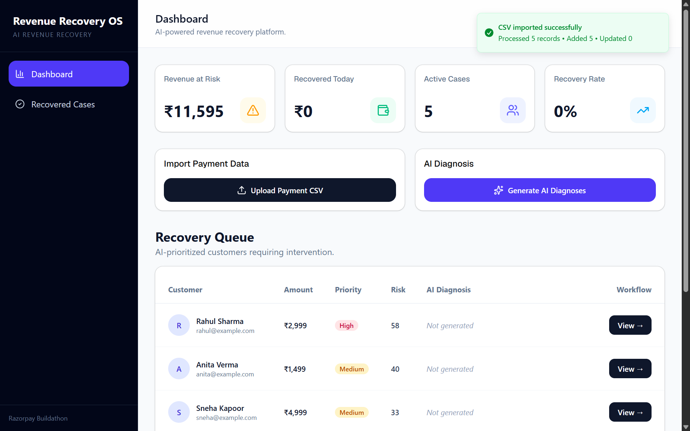
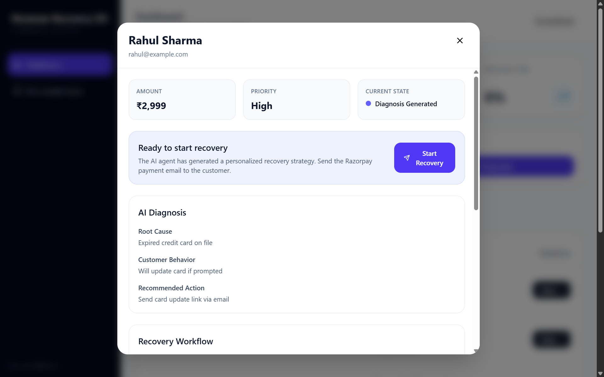
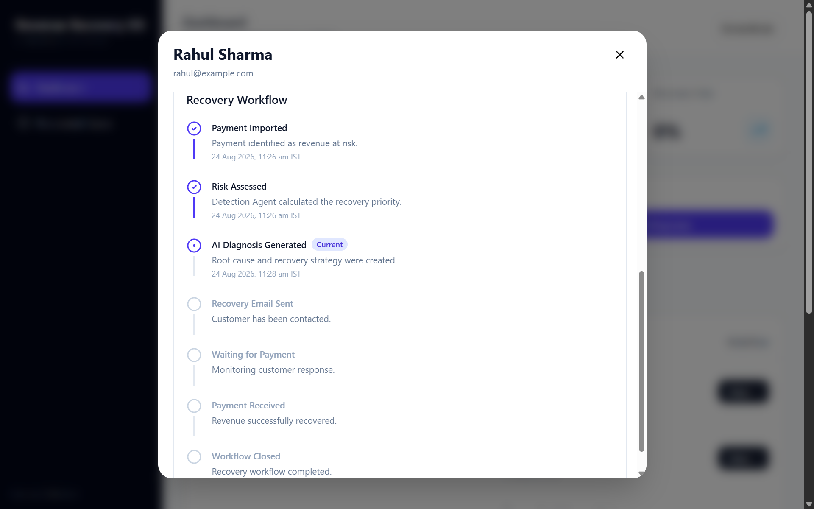
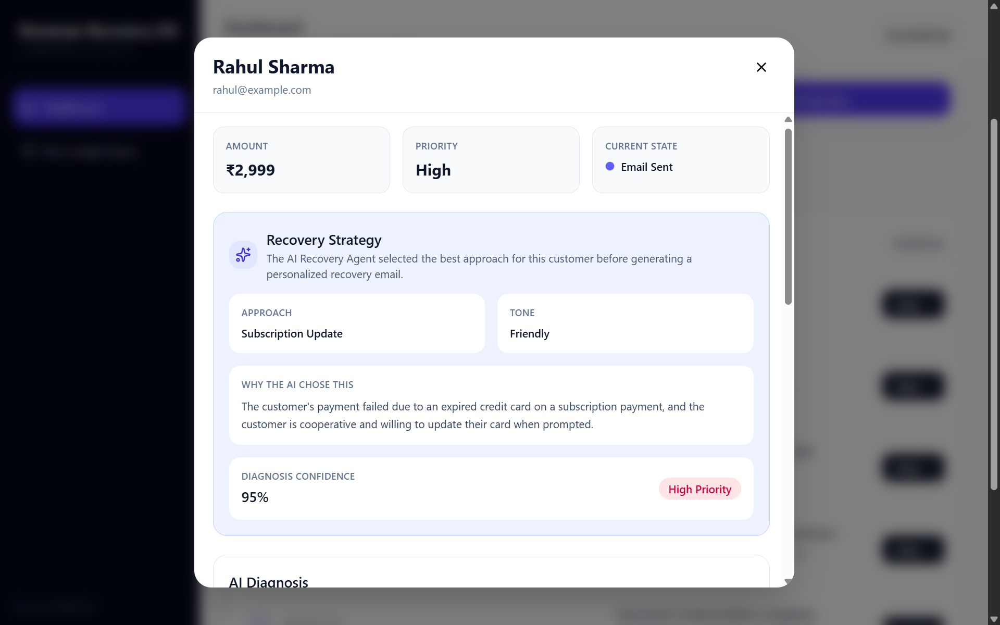
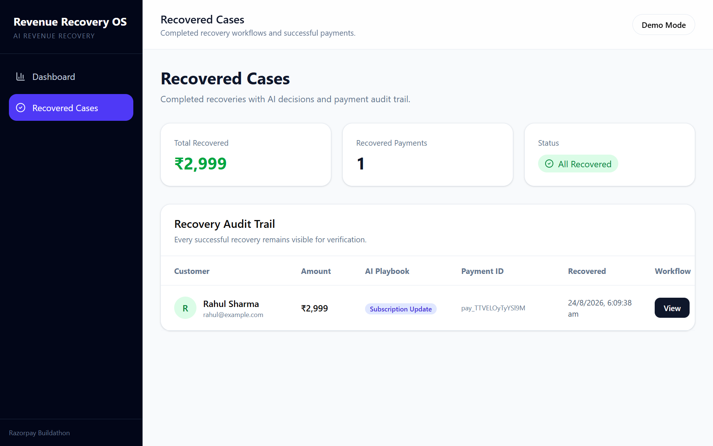
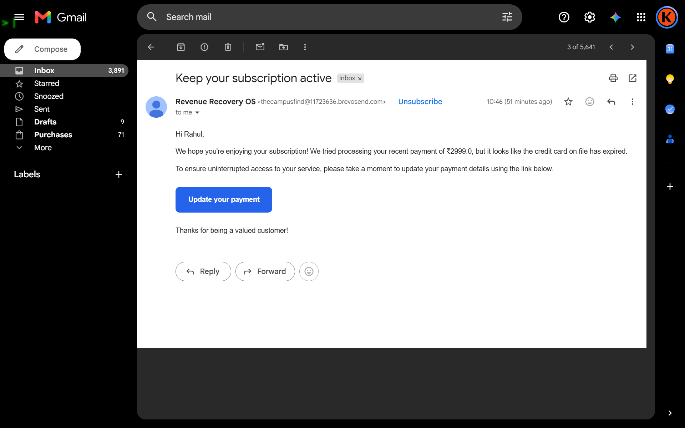

# Revenue Recovery OS

> AI-powered revenue recovery system for identifying at-risk payments, diagnosing payment failures, selecting recovery strategies, and automating customer recovery workflows.

Revenue Recovery OS is a full-stack AI revenue recovery platform built around an agent-based workflow. It takes payment data, evaluates recovery risk, uses AI to understand the likely cause of payment failure, selects an appropriate recovery strategy, contacts the customer, and tracks the recovery process through payment completion.

---

## 📸 Screenshots

### Dashboard



### AI Diagnosis



### Recovery Workflow



### Recovery Strategy



### Recovered Cases



### Customer Recovery Email



---

## ✨ Features

- CSV payment import for failed, overdue, and abandoned payments
- Automated risk scoring
- AI-powered payment failure diagnosis
- Customer behavior analysis
- AI-generated recovery strategies
- AI recovery decision agent for selecting an appropriate playbook
- Automated recovery email delivery through Brevo
- Razorpay payment recovery flow
- End-to-end recovery workflow tracking
- Timeline-based workflow visualization
- Risk-prioritized recovery queue
- Recovered cases tracking
- Dashboard KPIs:
  - Revenue at Risk
  - Recovered Today
  - Active Cases
  - Recovery Rate
- Demo data reset for quickly restarting demonstrations
- Toast notifications for important user actions

---

## 🧠 How It Works

```text
                    Payment Data
                         │
                         ▼
                 ┌─────────────────┐
                 │  CSV Import     │
                 └────────┬────────┘
                          │
                          ▼
                 ┌─────────────────┐
                 │ Detection Agent │
                 │  Risk Scoring   │
                 └────────┬────────┘
                          │
                          ▼
                 ┌─────────────────┐
                 │ Diagnosis Agent │
                 │   Gemini AI     │
                 └────────┬────────┘
                          │
                          ▼
              ┌────────────────────────┐
              │ Recovery Decision Agent│
              │  Selects Playbook      │
              └────────────┬───────────┘
                           │
                           ▼
                  ┌─────────────────┐
                  │ Recovery Agent  │
                  │ Executes Action │
                  └────────┬────────┘
                           │
                           ▼
                    Recovery Email
                           │
                           ▼
                  Razorpay Checkout
                           │
                           ▼
                    Payment Received
                           │
                           ▼
                    Workflow Closed
```

---

## 🤖 AI Agent Architecture

### 1. Detection Agent

The Detection Agent evaluates payment records and calculates a recovery risk score.

Signals currently considered include:

- Payment failure reason
- Number of previous payment attempts
- Payment amount
- Payment status

The score is converted into a recovery priority:

| Risk Score | Priority |
|------------|----------|
| 70–100 | Critical |
| 50–69 | High |
| 30–49 | Medium |
| 0–29 | Low |

The purpose of this layer is prioritization, not language generation.

### 2. Diagnosis Agent

The Diagnosis Agent uses Google Gemini to analyze payment records and generate structured recovery insights.

It produces:

- Root Cause
- Customer Behavior
- Recommended Strategy
- Confidence Score

The diagnosis is generated using a structured Pydantic schema rather than relying on free-form text.

### 3. Recovery Decision Agent

The Recovery Decision Agent determines which recovery playbook should be used for a particular case.

This separates:

```text
"What happened?"
```

from:

```text
"What should we do about it?"
```

### 4. Recovery Agent

The Recovery Agent executes the selected recovery workflow.

Depending on the selected strategy, the workflow can:

1. Generate recovery communication.
2. Send the customer an email.
3. Provide a payment recovery path.
4. Create a Razorpay payment order.
5. Track the customer's payment.
6. Close the workflow after successful recovery.

---

## 🎯 Priority vs Urgency vs Confidence

These values answer different questions and should not be treated as interchangeable.

### Priority

**How important is this case compared with other recovery cases?**

It is derived from the Detection Agent's risk score.

```text
Risk Score: 82
Priority: Critical
```

### Urgency

**How aggressively should the selected recovery strategy be executed?**

Urgency is part of the AI recovery decision and can therefore differ from the risk-based priority.

### Confidence

**How certain is the AI about its diagnosis?**

For example:

```text
Confidence: 0.91
```

means the model has high confidence in its generated diagnosis.

In short:

```text
Priority   → Case importance
Urgency    → Recovery action intensity
Confidence → AI certainty
```

---

## 🔄 Recovery Workflow

Every recovery case moves through a tracked workflow.

```text
Payment Imported
       ↓
Risk Scored
       ↓
AI Diagnosis Generated
       ↓
Recovery Strategy Selected
       ↓
Recovery Email Sent
       ↓
Waiting for Payment
       ↓
Payment Received
       ↓
Workflow Closed
```

Each workflow maintains a timeline containing:

- State
- Timestamp
- Event details

Completed recovery cases are removed from the active recovery queue and are available through the recovered cases view.

---

## 📊 Dashboard

The dashboard provides a high-level view of recovery performance.

### Revenue at Risk

Total amount currently associated with active unpaid recovery cases.

### Recovered Today

Revenue successfully recovered during the current day.

### Active Cases

Number of currently active recovery cases.

### Recovery Rate

Percentage of payment records that have been successfully recovered.

---

## 🏗️ Project Structure

```text
revenue-recovery-os/
│
├── backend/
│   ├── app/
│   │   ├── agents/
│   │   │   ├── detection_agent.py
│   │   │   ├── diagnosis_agent.py
│   │   │   ├── recovery_decision_agent.py
│   │   │   └── recovery_agent.py
│   │   │
│   │   ├── api/
│   │   │   ├── ai.py
│   │   │   ├── csv_parser.py
│   │   │   ├── dashboard.py
│   │   │   ├── diagnosis.py
│   │   │   ├── email.py
│   │   │   ├── payment.py
│   │   │   ├── recovery.py
│   │   │   ├── recovery_action.py
│   │   │   ├── upload.py
│   │   │   └── workflow.py
│   │   │
│   │   ├── models/
│   │   │   ├── diagnosis.py
│   │   │   ├── payment.py
│   │   │   └── workflow.py
│   │   │
│   │   ├── prompts/
│   │   │   └── diagnosis.py
│   │   │
│   │   ├── services/
│   │   │   ├── database.py
│   │   │   ├── email_service.py
│   │   │   ├── gemini.py
│   │   │   ├── razorpay_service.py
│   │   │   ├── csv_parser.py
│   │   │   └── workflow.py
│   │   │
│   │   └── main.py
│   │
│   ├── requirements.txt
│   └── .env.example
│
├── frontend/
│   ├── src/
│   │   ├── components/
│   │   ├── layout/
│   │   ├── pages/
│   │   ├── services/
│   │   ├── App.tsx
│   │   └── main.tsx
│   ├── package.json
│   └── vite.config.ts
│
├── sample-data/
│   └── payments_sample.csv
│
├── .gitignore
└── README.md
```

---

## 🛠️ Tech Stack

### Frontend

- React
- TypeScript
- Vite
- Tailwind CSS
- React Router
- Axios
- Sonner
- Lucide React
- shadcn/ui

### Backend

- Python
- FastAPI
- MongoDB
- Motor
- Pydantic
- Pandas

### AI

- Google Gemini

### Payments

- Razorpay

### Email

- Brevo

---

## 📋 Sample Payment Data

A sample dataset is included at:

```text
sample-data/payments_sample.csv
```

The dataset contains fields such as:

```text
customer_name
email
amount
payment_type
status
failure_reason
due_date
attempts
```

Example cases include:

- Expired cards
- Invoice overdue
- Checkout abandonment
- Bank timeout
- Pending payments

---

## ⚙️ Environment Variables

Create a `.env` file inside the `backend/` directory.

```env
GEMINI_API_KEY=
MONGODB_URI=

RAZORPAY_KEY_ID=
RAZORPAY_KEY_SECRET=

BREVO_API_KEY=
BREVO_SENDER_EMAIL=
BREVO_SENDER_NAME=

APP_BASE_URL=http://127.0.0.1:8000
FRONTEND_URL=http://localhost:5173

DEMO_EMAIL=
RAZORPAY_WEBHOOK_SECRET=
```

Never commit the actual `.env` file.

The repository contains `.env.example` as a template for required configuration.

---

## 🚀 Local Development

### Backend

```bash
cd backend
python -m venv venv
```

#### Windows

```bash
venv\Scripts\activate
```

#### macOS / Linux

```bash
source venv/bin/activate
```

Install dependencies:

```bash
pip install -r requirements.txt
```

Start FastAPI:

```bash
uvicorn app.main:app --reload
```

Backend:

```text
http://127.0.0.1:8000
```

Health check:

```text
http://127.0.0.1:8000/health
```

### Frontend

Open a second terminal:

```bash
cd frontend
npm install
npm run dev
```

Frontend:

```text
http://localhost:5173
```

---

## 🧪 Demo Workflow

1. Start MongoDB.
2. Start the backend.
3. Start the frontend.
4. Open the dashboard.
5. Upload `sample-data/payments_sample.csv`.
6. Generate AI diagnoses.
7. Review the prioritized recovery queue.
8. Open a recovery case.
9. Review its risk score, priority, diagnosis, recovery decision, and timeline.
10. Start the recovery workflow.
11. Complete the Razorpay test payment.
12. Verify that the workflow reaches `Payment Received` and then `Workflow Closed`.
13. Verify that the case moves from the active recovery queue to Recovered Cases.

---

## 🔌 API Overview

### Health

```http
GET /health
```

### Dashboard

```http
GET /dashboard/summary
POST /dashboard/reset-demo
```

### Payment Upload

```http
POST /upload/payments
```

### Recovery Cases

```http
GET /recovery/cases
```

### Diagnosis

```http
POST /diagnosis/generate
```

### Workflow

```http
GET /workflow/{payment_id}
```

### Email

```http
POST /email/test
```

### Recovery Actions

Recovery workflow actions are exposed through the recovery-action API.

### Payment

Payment order creation and payment-related operations are exposed through the payment API.

---

## 🔐 Security Notes

The application uses environment variables for external service credentials.

Never commit:

```text
.env
API keys
Database credentials
Razorpay secrets
Brevo API keys
Gemini API keys
Webhook secrets
```

The repository's `.gitignore` excludes local environment files and development artifacts.

---

## 🕐 Timezone Handling

Workflow timestamps use timezone-aware datetimes.

The application uses:

```text
Asia/Kolkata
```

for displayed workflow timestamps.

The backend converts timestamps before returning them to the frontend so the workflow timeline displays Indian Standard Time.

---

## 🧹 Demo Data Reset

The dashboard includes a reset-demo-data action intended for development and demonstrations.

This makes it possible to reuse the same sample CSV without manually clearing MongoDB.

> **Warning:** The reset functionality is intended for demo/development environments and should not be exposed as an unrestricted production operation.

---

## 🧪 Frontend Quality Checks

Build the frontend:

```bash
npm run build
```

Run linting:

```bash
npm run lint
```

---

## 🌐 Deployment

The application consists of two separately deployable parts:

```text
Frontend
   │
   ▼
Backend API
   │
   ├── MongoDB
   ├── Gemini
   ├── Brevo
   └── Razorpay
```

Before deployment:

1. Configure production environment variables.
2. Replace the local frontend API URL with the deployed backend URL.
3. Configure backend CORS for the deployed frontend URL.
4. Deploy the backend.
5. Deploy the frontend.
6. Configure the Razorpay webhook using the deployed backend endpoint.
7. Run a complete end-to-end recovery test.

---

## ⚠️ Current Limitations

- Razorpay currently operates in test mode for the demo workflow.
- Production payment confirmation requires deployed Razorpay webhook configuration.
- CSV is currently the primary payment-data ingestion method.
- Authentication and role-based access control are not currently implemented.
- The application is designed as a buildathon/demo system rather than a production billing platform.

---

## 🔮 Future Improvements

- Production-grade webhook handling
- Scheduled autonomous recovery workflows
- Additional payment providers
- Customer-level recovery history
- Advanced recovery analytics
- More sophisticated risk models
- Authentication and role-based access control
- Audit logs
- Retry and failure handling
- Monitoring and observability
- Automated experimentation for recovery strategies

---

## 🏁 Project Status

**Status: Functional buildathon/demo application**

The core recovery workflow is implemented end-to-end:

```text
CSV Import
   ↓
Risk Detection
   ↓
AI Diagnosis
   ↓
AI Recovery Decision
   ↓
Recovery Email
   ↓
Razorpay Checkout
   ↓
Payment Confirmation
   ↓
Workflow Closure
   ↓
Recovered Case
```

---

## 📜 License

This project was developed as a buildathon project.
